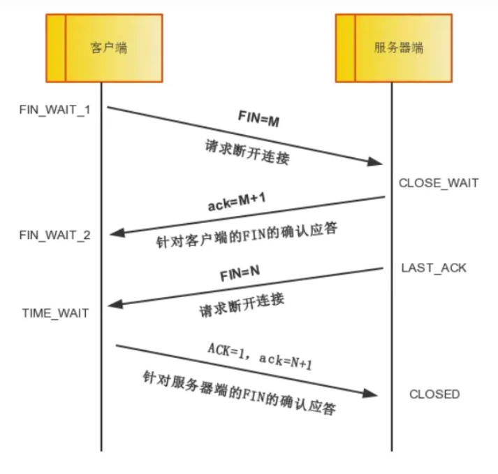

# socket知识点

## 函数

### int socket(int portofamily, int type, int protocol)

1. portofamily：协议域常用协议族: AF_INET(IPV4)、AF_INET6(IPV6) 、AF_LOCAL(UNIX)、AF_ROUTE
2. type:socket类型
   常见类型：SOCK_STREAM、SOCK_DGRAM、SOCK_RAM、SOCK_PACKET、SOCK_SEQPACKET
   SOCK_STREAM:面向连接的嵌套字，传输过程中数据不会消失，按序传输数据，传输的数据不存在数据边界
   SOCK_DARAM:面向消息的嵌套字，强调快速传输而非传输顺序，传输的数据可能丢失也可能损毁，传输的数据有数据边界，并且限制每次传输的数据大小
3. protocol：协议类型
   常见协议：IPPROTO_TCP(IPV4面向连接)、TPPTOTO_UDP(IPV4面向消息)、IPPROTO_SCTP、IPPROTO_TIPC
4. 返回值：成功返回描述符，失败返回-1
5. 功能：服务器及客户端函数，创建一个描述符

### int bind(int sockfd, struct sockaddr_in * addr, int addrlen)

1. socketfd：描述符
2. addr：绑定给socketfd的协议地址
3. addrlen：协议地址长度
4. 返回值：成功返回0，失败返回-1
5. 功能：服务器端函数，将嵌套字与地址绑定

```C

/*网络信息结构体*/
struct sockaddr_in {

   sa_family_t    sin_family;   /*协议族: AF_INET(IPV4)、AF_INET6(IPV6) 、AF_LOCAL(UNIX)、AF_ROUTE*/

   in_port_t      sin_port;     /*网络地址端口*/

   struct in_addr sin_addr;     /*网络地址*/

};

/*网络地址结构体*/
struct in_addr {

   uint32_t   s_addr;

};

```

```C
/*IPV6网络信息结构体*/
struct sockaddr_in6 {

   sa_family_t     sin_family;   /*协议族: AF_INET6(IPV6)

   in_port_t       sin_port;     /*网络地址端口*/

   uint32_t        sin6_flowinfo /*包含IPV6报头中的通信流类别字段和流标签字段*/

   struct in6_addr sin6_addr;     /*网络地址*/

   uint32_t        sin6_scope_id  /*包含了范围ID，它用于标识一系列的接口，这些接口与地址字段中的地址相对应*/

};

/*网络地址结构体*/
struct in6_addr {

   unsigned   s6_addr[16];

};

```

```C

#define UNIX_PATH_MAX 108

/*UNIX网络信息结构体*/
struct sockaddr_un {

   sa_family_t  sin_family;                /*协议族: AF_UNIX(UNIX)*/

   char         sun_path[UNIX_PATH_MAX];   /*地址名称)*/     

};


```

### int listen(int socketfd, int backlog)

1. socketfd：将要进行监听描述符
2. backlog：设置socket可以排队的最大连接个数
3. 返回值：成功返回0，失败返回-1
4. 功能：服务器端函数，开始监听socket，这时客户端connect()函数可以发出请求

### int connect(int socketfd, const struct sockaddr * addr, socklen_t addrlen)

1. socketfd：描述符
2. addr：将要连接服务器的地址
3. 服务器地址长度
4. 返回值：成功返回0，失败返回-1
5. 功能：客户端函数，与服务器相应地址连接

### int accept(int socketfd, struct sockaddr * addr, struct socklen_t * addrlen)

1. socketfd：描述符
2. addr：客户端地址，如果不需要，可设置为NULL
3. addrlen：客户端地址长度，如果不需要，可设置为NULL
4. 返回值：成功返回连接成功后的描述符
5. 功能：服务器端函数，服务器获取并建立连接

### int read/write(int socketfd, void * buf, size_t len)

1. socketfd：描述符
2. buf：读取存放数据的缓存地址
3. len：缓存地址长度
4. 返回值：返回0表示读到接收文件结束或对端close,大于0表示接收到的字节数，当read()或者write()返回-1时，一般要判断errno如果errno == EINTR,表示系统当前中断了，直接忽略如果errno == EAGAIN或者EWOULDBLOCK，非阻塞socket直接忽略;如果是阻塞的socket,一般是读写操作超时了，还未返回。这个超时是指socket的SO_RCVTIMEO与SO_SNDTIMEO两个属性。所以在使用阻塞socket时，不要将超时时间设置的过小。不然返回了-1，你也不知道是socket连接是真的断开了，还是正常的网络抖动。一般情况下，阻塞的socket返回了-1，都需要关闭重新连接。

### int shutdown(int sock, int howto)

1. sock：描述符
2. htwto：传递断开方式信息 SHUT_RD:断开输入流 SHUT_WR:断开输出流 SHUT_RDWR:同时断开I/O流
3. 返回值：成功返回0，失败返回-1
4. 功能：关闭I/O流

### int inet_aton(const char * cp, struct in_addr * inp)

1. 功能：将一个字符串IP地址转化成一个32位的网络字节IP地址。
2. 返回值：成功返回非零， 失败返回0， 这个函数没有错误码存放在errno.

### char * inet_ntoa(struct in_addr in)

1. 把网络字节IP地址转换成字符串的IP地址

### in_addr_t inet_addr(const char * str)

1. 功能：将一个字符串IP地址转化成32位的网络字节IP地址
2. 返回值：返回一个32位的网络字节IP地址

### int htonl(int hostlong)

1. 功能：将一个32位的主机顺序字节转换为32位的网络顺序字节。
2. 返回值：返回一个32位的网络字节IP地址

### short htons(short hostlong)

1. 功能：将一个16位的主机顺序字节转换成16位的网络顺序字节。
2. 返回值：一个16位的网络顺序字节。

### int ntohl(int hostlong)

1. 功能：将一个32位的网络顺序字节转换成32位的主机顺序字节。
2. 返回值：返回一个32位的主机顺序字节。

### short ntohs(short hsotlong)

1. 功能：将一个16位的网络顺序字节转换成16位的主机顺序字节。
2. 返回值：返回一个16位的主机顺序字节。

### int atoi(const char *str)

1. 功能：将字符串转换成一个整数
2. 返回值：返回一个整数

### long atol(const char * str)

1. 功能：将字符串传换成一个长整型
2. 返回一个长整型数据

## 网络地址分类与主机地址边界


A类地址首字节范围：0~127
B类地址首字节范围：128~191
C类地址首字节范围：192~223

## TCP协议

### TCP头部规范定义


1. TCP端口号

TCP的连接需要四个要素确定唯一连接：（源IP,源端口号）（目的IP,目的端口号）

端口号占16字节 范围是0~65535，另外0~1023是系统保留的，用户使用1024~65535

2. TCP的序号和确认号

32位序号SEQ:位序列号，TCP通信过程中某一个传输方向上的字节流的每个字节的序号，通过这个确认发送的数据有，比如现在的序列号为1000，发送了1000个字节，那么下一个序列号就是2000

32位确认号ack：TCP对上一次SEQ序列号做出的确认号，用来响应TCP报文段的序号SEQ+字节数+1

3. TCP的标志位

SYN:同步标志位，用于建立会话连接，同步序列号
ACK:确认标志位，对已接收的数据包进行确认
FIN:完成标志位，无数据发送，即将关闭连接
PSH:推送标志位，表示该数据包被对方接收后立即上交给应用层，而不是在缓冲区排队
RST:重置标志位，用于连接复位、拒绝错误和非法的数据包
URG:紧急标志位，表示数据包的紧急指针域有效，用来保证连接不被阻止，并督促中间设备尽快处理

### TCP的三次握手

所谓三次握手，是指建立一个TCP连接时，需要客户端和服务端总共发送3个报文
三次握手的目的是连接服务器指定端口，建立TCP连接，并同步连接双方的序列号和确认号，交换TCP窗口大小信息。在socket编程中，客户端执行connect时，将触发三次握手。


1. 第一次握手
   客户端将TCP报文标志位SYN设置为1，随机产生一个序列号SEQ=J,保存在TCP首部的序列号字段里，指明客户端需要连接的服务器端口号， 并将该数据包发送给服务器端以确认连接请求，客户端进入SYN_SEND状态。
2. 第二次握手
   服务器端收到数据包后由标志位SYN=1知道客户端请求建立连接，服务器端将TCP报文标志位SYN和ACK都置为1，ack=J+1，随机产生一个序列值SEQ=K，并将该数据包发送给客户端以确认连接请求，服务器端进入SYN_RCVD状态。
3. 第三次握手
   客户端收到确认后，检查ack是否位J+1，ACK是否为1，如果正确则将标志位ACK置为1，ack=K+1，并将该数据包发送给服务器端，服务器端检查ack是否为K+1，ACK是否为1，如果正确则连接建立成功，客户端和服务器端进入ESTABLISHED状态，完成三次握手，随后客户端与服务器端之间可以开始传输数据了

### TCP的四次挥手



1. 第一次挥手
   客户端发起挥手请求，向服务器端发送FIN=1\SEQ=M的报文，此时客户端进入等待状态，没有数据发送给服务器端
2. 第二次挥手
   服务器端接收到FIN=1的报文，向客户端发送ACK=1\ack=M+1的报文，表示确认并同意客户端的关闭请求
3. 第三次挥手
   服务器端向客户端发送FIN=1\SEQ=N的报文，请求关闭连接。
4. 第四次挥手
   客户端向服务器端发送ACK=1\ack=N+1的报文，服务器端接收到报文后关闭连接。客户端等待2MSL(MSL:报文段最大生存空间)后没有接受到回复，则证明服务器端正常关闭，然后客户端关闭连接

## 域名系统

### 什么是域名

提供网络服务的服务器端也是通过IP地址区分的，但几乎不可能以非常难记得IP地址形式交换服务器地址信息。因此，将容易记、易表述、不易变的域名分配并取代IP地址

ping www.naver.com 来得到某一域名的IP地址

### 函数

#### struct hostent * gethostbyname(const char * hostname)

1. 头文件：netdb.h
2. hostname：域名字符串
3. 功能：通过域名转获取IP地址
4. 返回值：成功返回hostent结构体，失败返回NULL

```C
struct hostent
{
   char * h_name;    //该变量存在的官方域名。官方域名代表某一主页，但实际上一些著名公司得分域名并未用官方域名注册
   char ** h_aliases; //可以通过多个域名访问同一主页。同一IP可以绑定多个域名，信息通过该数据获取
   int h_addrtype;    //获取地址族信息  IPv4:AF_INET
   int h_length;      //保存IP地址的长度 IPv4为4字节 IPv6为16字节
   char ** h_addr_list; //此变量以整数形式保存域名对应的IP地址。用户较多的网站可能将多个IP分配给同一域名利用多个服务器进行负载均衡。
}

```

#### struct hostent * gethostbyaddr(const char * addr, socklen_t len, int family)

1. 头文件：netdb.h
2. addr：IP字符串
3. len：字符串长度 IPv4为4字节， IPv6为16字节
4. family：地址族
5. 功能：通过IP地址获取绑定的域名
6. 执行未通过

## 嵌套字的多种可选项和I/O缓冲大小

### 嵌套字的多种可选性

#### 种类

|   协议层   |      选项名      |   读写   |      功能      |
| :---------: | :---------------: | :------: | :-------------: |
| SOL_SOCKET |     SO_SNDBUF     | 可读可写 | 发送区缓冲大小 |
| SOL_SOCKET |     SO_RCVBUF     | 可读可写 | 接收区缓冲大小 |
| SOL_SOCKET |   SO_REUSEADDR   | 可读可写 | Time-wait状态 1 |
| SOL_SOCKET |   SO_KEEPALIVE   | 可读可写 |                |
| SOL_SOCKET |   SO_BROADCAST   | 可读可写 |    开启广播    |
| SOL_SOCKET |   SO_DONTROUTE   | 可读可写 |                |
| SOL_SOCKET |   SO_OOBINLINE   | 可读可写 |                |
| SOL_SOCKET |     SO_ERROR     |   可读   |    错误类型    |
| SOL_SOCKET |      SO_TYPE      |   可读   |   嵌套字类型   |
| IPPROTO_IP |      IP_TOS      | 可读可写 |                |
| IPPROTO_IP | IP_MULTICAST_TTL | 可读可写 |                |
| IPPROTO_IP | IP_MULTICAST_LOOP | 可读可写 |                |
| IPPROTO_IP |  IP_MULTICAST_IF  | 可读可写 |                |
| IPPROTO_TCP |   TCP_KEEPALIVE   | 可读可写 |                |
| IPPROTO_TCP |    TCP_NODELAY    | 可读可写 | 1禁用Nagle算法 |
| IPPROTO_TCP |    TCP_MAXSEG    | 可读可写 |                |

#### 函数

##### int getsockopt(int sock, int level, int optname, void * optval, socklen_t * optlen)

1. sock：嵌套字描述符
2. level：要查看的可选项的协议层
3. optname：要查看的可选项
4. optval：保存查看结果的缓冲地址值
5. optlen：缓冲区长度，调用函数后保存可选项信息的字节数
6. 返回值：成功返回0，失败返回-1
7. 功能：对嵌套字可选项信息读取

##### int setsockopt(int sock, int level, int optname, const void * optval, soocklen_t optlen)

1. sock：嵌套字描述符
2. level：要设置的可选项的协议层
3. optname：要设置的可选项
4. optval：保存设置的缓冲地址值
5. optlen：可选项信息的字节数
6. 返回值：成功返回0，失败返回-1
7. 功能：对嵌套字可选项信息设置
8. 设置SO_RCVBUF与SO_SNDBUF时对设置的数据翻倍？

## 多进程服务器端

### 并发服务器端的实现方法

- [X] 多进程服务器
- [X] 多路复用服务器
- [X] 多线程服务器
